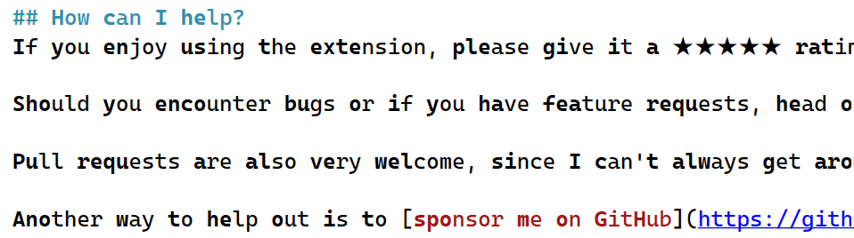
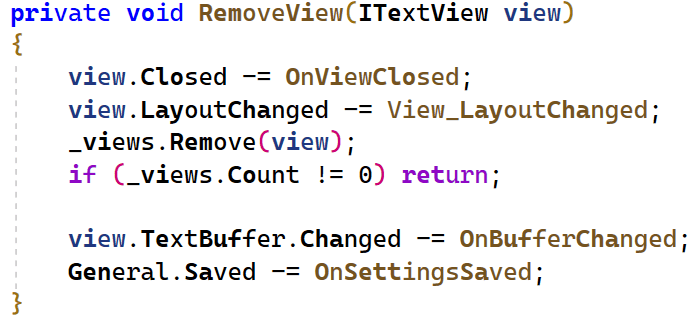
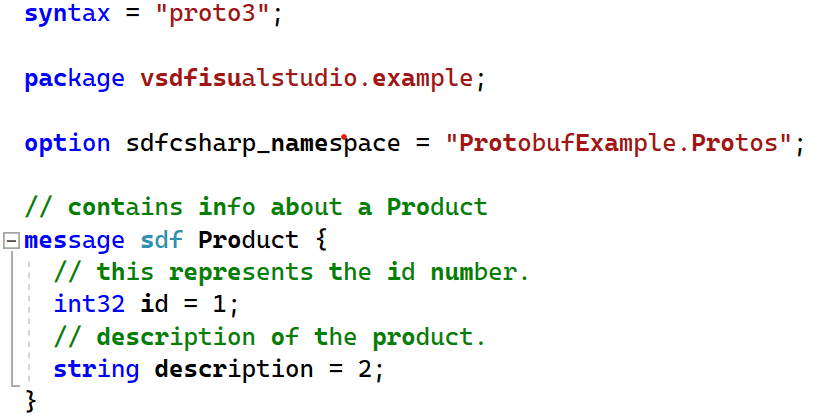
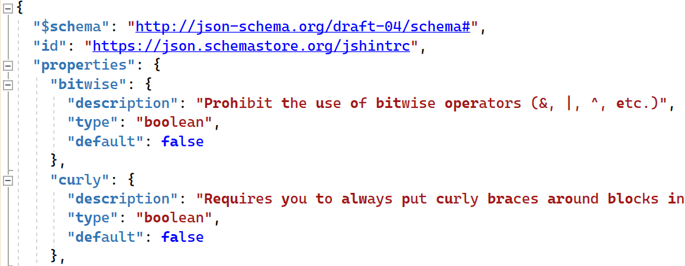

[marketplace]: https://marketplace.visualstudio.com/items?itemName=MadsKristensen.EmphasizeWords
[vsixgallery]: http://vsixgallery.com/extension/BionicReading.5fc630d9-8214-4730-b3e7-60d50c1eaa1b/
[repo]:https://github.com/madskristensen/EmphasizeWords

# Emphasize Words for Visual Studio

Download this extension from the [Visual Studio Marketplace][marketplace]
or get the [CI build][vsixgallery].

----------------------------------------
## What is Bionic Reading?
Bionic reading is a newly developed reading method designed to aid 
in the speed reading process through a couple of tweaks. 

The method was recently invented by a Swiss developer called 
Renato Casuut and he claims that by guiding your eyes through 
“fixation points”, your reading speed and level of comprehension 
are going to be improved. What this actually means is that through 
bionic reading, you are actually reading a text where several 
letters are written in bold in every word. 

[Read more about Bionic Reading](https://basmo.app/bionic-reading/)

## Screenshots of Emphasize Words in Visual Studio

### Markdown

### C# 

### Proto

### JSON

## How can I help?
If you enjoy using the extension, please give it a ★★★★★ rating on the [Visual Studio Marketplace][marketplace].

Should you encounter bugs or if you have feature requests, head on over to the [GitHub repo][repo] to open an issue if one doesn't already exist.

Pull requests are also very welcome, since I can't always get around to fixing all bugs myself. This is a personal passion project, so my time is limited.

Another way to help out is to [sponsor me on GitHub](https://github.com/sponsors/madskristensen).
